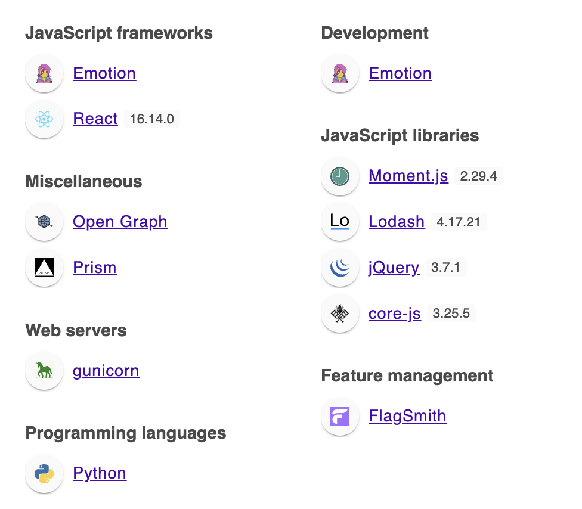
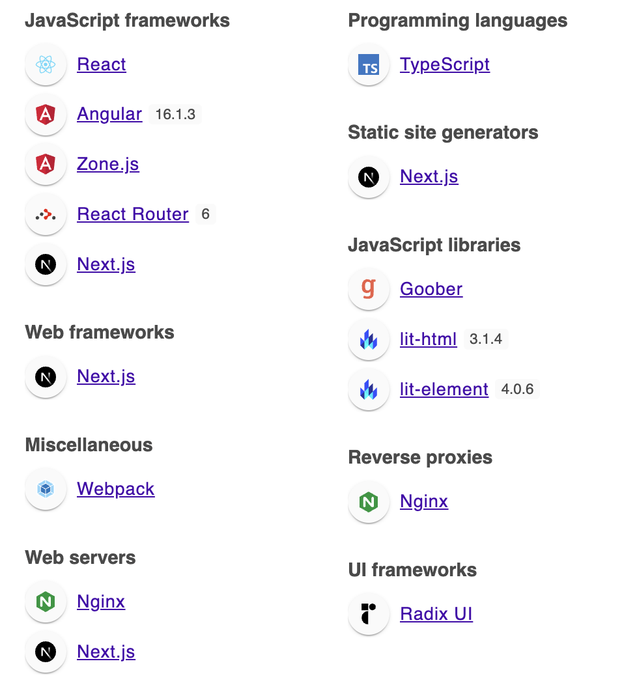
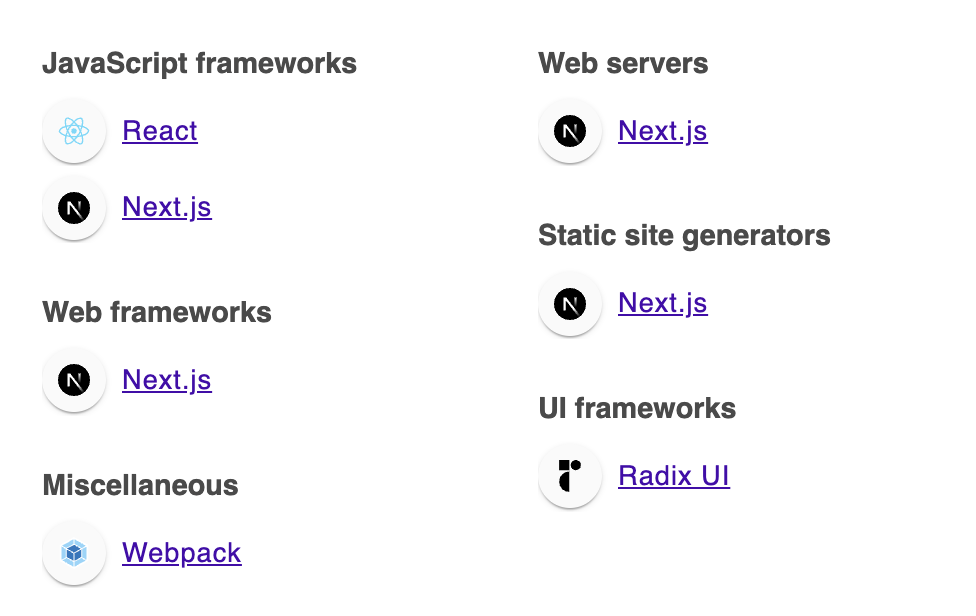
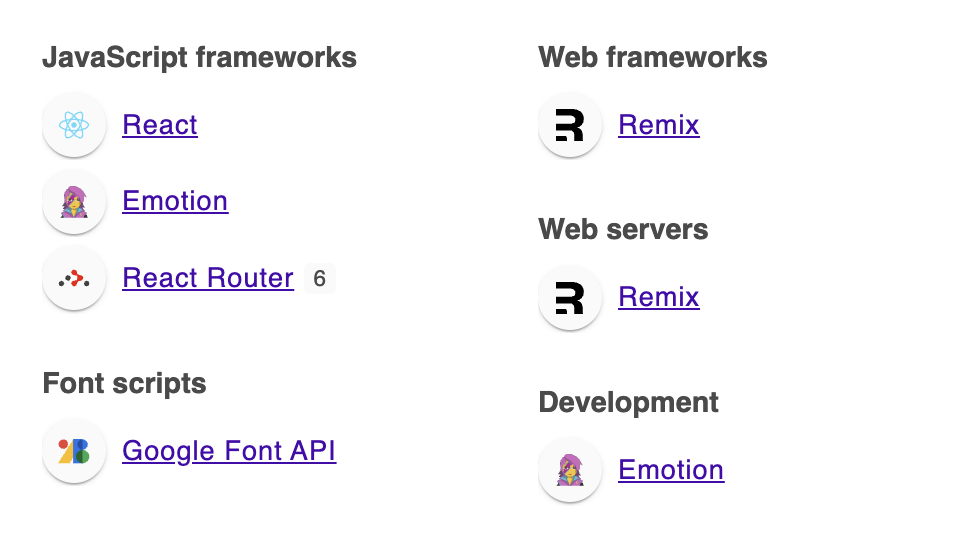

# Feature-Flags Demo Application

This application showcases the usage of feature flags with different backends. The application uses the following backends to manage feature flags:

- [Unleash](https://getunleash.io/)
- [FeatBit](https://www.featbit.co/)
- [Flagsmith](https://flagsmith.com/)
- [GrowthBook](https://www.growthbook.io/)

Note: [Flipt](https://docs.flipt.io/) has also been considered but at the moment [it does not provide](https://github.com/flipt-io/flipt-client-sdks/issues/345) with a React Native client.

Get started:

- Install dependencies with `npm i`
- Copy the `.env.example` file to `.env`. Fill in the required environment variables for each backend in the next steps.
- Start the backends. To do that, clone the repository for each backend and start the Docker stack. Instructions for each backend are provided below.
- Once the backends are running start the application with `npm run dev` and navigate to [http://localhost:5173](http://localhost:5173). Login with one of the users given in the select input. You will see which feature flags are enabled for that particular user for each backend.

Notes:

- The application uses server-side client SDKs to fetch feature flags from each backend
- You can start the application without any backends. The color of the feature flag status will be purple. If you only want to test only one or more backends, you can do that.
- The application uses the `userId` field to target users. You can see the `userId` when you're logged in with that user in the application.
- Replace `XXXXX` in the environment variables with the actual values for each backend. If you update the environment variables, please restart the application for the changes to take effect.

## Start the backends

### Unleash

- Clone the Unleash repository and start the Docker stack:

```sh
git clone https://github.com/Unleash/unleash.git
cd unleash
docker compose up -d
```

```text
CONTAINER ID   NAMES           IMAGE                              COMMAND                  PORTS                    
52390686b8aa   unleash-web-1   unleashorg/unleash-server:latest   "docker-entrypoint.s…"   0.0.0.0:4242->4242/tcp   
9344c6c54c6d   unleash-db-1    postgres:15                        "docker-entrypoint.s…"   5432/tcp                 
```

- Point your browser to `localhost:4242` and log in using:

```text
username: admin
password: unleash4all
```

- Update environment variables:

```sh
UNLEASH_SERVER_URL=http://localhost:4242/api/
UNLEASH_SERVER_TOKEN=default:development.unleash-insecure-api-token
UNLEASH_APPLICATION_NAME=nearform
```

### FeatBit

- Clone the FeatBit repository and start the Docker stack:

```sh
git clone https://github.com/featbit/featbit.git
cd featbit
docker compose up -d
```

```text
CONTAINER ID   NAMES                         IMAGE                                          COMMAND                  PORTS                      
dafede32a11e   featbit-ui-1                  featbit/featbit-ui:latest                      "./docker-entrypoint…"   0.0.0.0:8081->80/tcp       
6041d579cf0e   featbit-api-server-1          featbit/featbit-api-server:latest              "./start.sh"             0.0.0.0:5000->5000/tcp     
0d9a42adcb27   featbit-evaluation-server-1   featbit/featbit-evaluation-server:latest       "./start.sh"             0.0.0.0:5100->5100/tcp     
b33463eb39ab   featbit-da-server-1           featbit/featbit-data-analytics-server:latest   "./docker-entrypoint…"   0.0.0.0:8200->80/tcp       
f4f741343e5a   featbit-mongodb-1             mongo:5.0.14                                   "docker-entrypoint.s…"   0.0.0.0:27017->27017/tcp   
cdd4ce6ef9f4   featbit-redis-1               bitnami/redis:6.2.10                           "/opt/bitnami/script…"   0.0.0.0:6379->6379/tcp     
```

- Point your browser at [http://localhost:8081](http://localhost:8081) and log in with the default credentials:

```text
Username: test@featbit.com
Password: 123456
```

- Create a default project and copy the server key by hovering over the Dev environment in the top right corner of the UI

- Update environment variables:
    
```sh
FEATBIT_SDK_KEY=XXXXX
FEATBIT_STREAMING_URL=ws://localhost:5100
FEATBIT_EVENTS_URL=http://localhost:5100
```

### Flagsmith

- Clone the Flagsmith repository and start the Docker stack:

```sh
git clone https://github.com/Flagsmith/flagsmith.git
cd flagsmith
docker compose up -d
```

```text
CONTAINER ID   NAMES                             IMAGE                                                  COMMAND                  PORTS                    
75736444821f   flagsmith-flagsmith_processor-1   flagsmith.docker.scarf.sh/flagsmith/flagsmith:latest   "/app/scripts/run-do…"   8000/tcp                 
7538d8478a20   flagsmith-flagsmith-1             flagsmith.docker.scarf.sh/flagsmith/flagsmith:latest   "/app/scripts/run-do…"   0.0.0.0:8000->8000/tcp   
69634b841623   flagsmith_postgres                postgres:15.5-alpine                                   "docker-entrypoint.s…"   5432/tcp                 
```

- The application will bootstrap an admin user, organisation, and project for you. This will take some time. Copy the link to set your password from the container logs:

```txt
Superuser "admin@example.com" created successfully.
Please go to the following page and choose a password: http://localhost:8000/password-reset/confirm/.../...
```

- Point your browser to `localhost:8000` and set a password for `admin@example.com` at the URL provided in the logs.

- Login, click on the `Default` project, and create an environment. Go to the `SDK Keys` tab, create a server-side environment key, and copy it.

- Update environment variables:

```sh
FLAGSMITH_ENVIRONMENT_KEY=XXXXX
FLAGSMITH_API_URL=http://localhost:8000/api/v1/
```

### GrowthBook

- Clone the GrowthBook repository and start the Docker stack:

```sh
git clone https://github.com/growthbook/growthbook.git
cd growthbook
docker-compose up -d
```

```text
CONTAINER ID   NAMES                     IMAGE                          COMMAND                  PORTS                                           
e6c85b26da3a   growthbook-growthbook-1   growthbook/growthbook:latest   "yarn start"             0.0.0.0:3000->3000/tcp, 0.0.0.0:3100->3100/tcp  
34de1e5c3c46   growthbook-mongo-1        mongo:latest                   "docker-entrypoint.s…"   27017/tcp                                       
```

- Point your browser at [http://localhost:3000](http://localhost:3000), create an account and login

- In the Client SDK Configuration section:
  - Click on Environments and create a new development environment
  - Click on SDK Connections and create a new connection for Node.js for the development environment
  - Copy the client key

- Update environment variables:

```sh
GROWTHBOOK_CLIENT_KEY=XXXXX
GROWTHBOOK_API_URL=http://localhost:3100
```

## Start the application

- Start the application: `npm run dev`
- Open up [http://localhost:5173](http://localhost:5173)
- Login with one of the users in the select input

## Configure feature flags
The application looks for a feature flag named `{backend}-test-flag` in each backend.

### Unleash
> One of the most important aspects of the Unleash architecture is that feature flags are evaluated directly in the client SDKs that run as part of your application. This makes flag evaluations incredibly fast (we're talking nano-seconds), scalable, and resilient against network disturbances. To achieve this, Unleash incurs a small update-delay when you change your flag configurations until it is fully propagated to your application. This delay is typically a few seconds and is configurable.

> To be super fast (we're talking nano-seconds), the client SDK caches all feature flags and their current configuration in memory. The activation strategies are also implemented in the SDK. This makes it really fast to check if a flag is on or off because it is just a simple function operating on local state, without the need to poll data from the database.

> By default this SDK will use a store provider that writes a backup of the feature toggle configuration to a file on disk. This happens every time it receives updated configuration from the Unleash API. You can swap out the store provider with either the provided in-memory store provider or a custom store provider implemented by you.

[Node SDK](https://docs.getunleash.io/reference/sdks/node)

- Create a new feature flag with the name `unleash-test-flag`:
  - In the `Default` project click on `New feature flag`
  - Give it the name `unleash-test-flag` and configure it as a `Kill switch` with `Impression data on`
  - Click on `Create feature flag`

- Edit the `Gradual rollout` strategy for the feature flag in the `development` environment
  - The `Enabled` `Strategy Status` toggle should be on
  - In the `Targeting` tab, add a new `Constraint` with the field `userId` and the operator `IN` with the value of one or more `userId` fields

- Check that the feature flag is red in the application for the user you're logged in with

- Enable the feature flag for the `development` environment

- Check that the feature flag is green in the application for the user you're logged in with

- Logout, login with another user and check that the feature flag is red

- Go back to Unleash UI and check the `Metrics` tab for the feature flag

### FeatBit

- Create a new feature flag with the name `featbit-test-flag`
- Set the default value to `false`
- Enable the flag
- Check that the feature flag is red in the application for the user you're logged in with
- Add individual targeting: select a user from the list (you should see the user you are currently logged in with) and save the changes
- Check that the feature flag is green in the application for the user you're logged in with
- Logout, login with another user and check that the feature flag is red

[Docs](https://docs.featbit.co/)

### Flagsmith

> In Local Evaluation mode, all flag values are calculated locally, on your server. The Flagsmith SDK includes an implementation of the Flag Engine, and the engine runs within your server environment within the Flagsmith SDK. The benefits to doing this are mainly one of latency and performance. Your server-side code does not need to hit the Flagsmith API each time a user requests their flags - the flags can be computed locally. Hence it does not need to block and wait for a response back from the Flagsmith API.

> In order to keep their Environment data up-to-date, SDKs running in Local Evaluation mode will poll the Flagsmith API regularly and update their local Environment data with any changes from the Flagsmith API. By default the SDK will poll the Flagsmith every 60 seconds; this rate is configurable within each SDK.

[Docs](https://docs.flagsmith.com/)

- Check that the feature flag is red in the application for the user you're logged in with

- Create a new feature flag with the name `flagsmith-test-flag`:
  - In the `Features` tab click on `Create Feature`
  - Give it the name `flagsmith-test-flag`, toggle the `Server-side only` switch on, and click on `Create`

- Check that the feature flag is red in the application for the user you're logged in with

- What happened to auto creating identities? ...

### GrowthBook

[Docs](https://docs.growthbook.io/)

- Create a new feature with the name `growthbook-test-flag` and the type `Boolean`
- Check that the feature flag is red in the application for the user you're logged in with
- Add a Forced Value for the feature flag. Force value to `true`. Add Attribute Targeting for the attribute `id` and the operator `is` with the value of one or more `userId` fields
- Click on Review and Publish and publish the changes
- Check that the feature flag is green in the application for the user you're logged in with
- Logout, login with another user and check that the feature flag is red

## Feature Flag Services Comparison Matrix

### Infrastructure & Dependencies

| Feature                  | Flagsmith | Unleash  | FeatBit  | GrowthBook |
|-------------------------|-----------|----------|----------|------------|
| Primary Database        | PostgreSQL| PostgreSQL| MongoDB  | MongoDB    |
| Redis Requirement       | Optional  | No       | Required | Optional   |
| Kubernetes Support      | ✅        | ✅       | ✅       | ✅         |
| Helm Charts            | ✅        | ✅       | ✅       | ✅         |
| Docker Images          | ✅        | ✅       | ✅       | ✅         |
| Additional Infrastructure| InfluxDB (optional) | None | Kafka (optional) | Analytics DB¹ |

¹ Supports Snowflake, BigQuery, Redshift, PostgreSQL, ClickHouse, MySQL

### Core Features

| Feature                  | Flagsmith | Unleash  | FeatBit  | GrowthBook |
|-------------------------|-----------|----------|----------|------------|
| RBAC                    | ✅        | ✅       | ✅       | ✅         |
| SSO Integration         | Enterprise| Enterprise| Custom   | Enterprise |
| Audit Logging           | ✅        | ✅       | ✅       | ✅         |
| Real-time Updates       | Polling   | Polling  | WebSocket| Polling    |
| Multi-environment       | ✅        | ✅       | ✅       | ✅         |
| Environment Cloning     | ✅        | ✅       | ✅       | ✅         |
| Bulk Operations         | ✅        | ✅       | ✅       | ✅         |

### Developer Experience

| Feature                  | Flagsmith | Unleash  | FeatBit  | GrowthBook |
|-------------------------|-----------|----------|----------|------------|
| SDK Language Support    | Extensive | Extensive| Limited  | Extensive  |
| TypeScript Support      | Basic     | Good     | Basic    | Excellent  |
| Local Override         | ✅        | ✅       | ✅       | ✅         |
| Testing Utilities      | ✅        | ✅       | Basic    | ✅         |
| API Type              | REST      | REST     | REST+WS  | GraphQL    |
| Offline Mode          | ✅        | ✅       | ✅       | ✅         |
| Documentation Quality  | High      | High     | Medium   | High       |
| Backend Language      | Python    | Node.js  | .NET   | Node.js    |
| Backend Framework     | Django    | Express  | ?  | Express    |

#### Flagsmith Frontend


#### Featbit Frontend
                                                                             

#### GrowthBook Frontend


#### Unleash Frontend


### Targeting & Rules

| Feature                  | Flagsmith | Unleash  | FeatBit  | GrowthBook |
|-------------------------|-----------|----------|----------|------------|
| User Targeting          | ✅        | ✅       | ✅       | ✅         |
| Percentage Rollouts     | ✅        | ✅       | ✅       | ✅         |
| Custom Rules            | ✅        | ✅       | ✅       | ✅         |
| Gradual Rollouts       | ✅        | ✅       | ✅       | ✅         |
| Custom Attributes      | ✅        | ✅       | ✅       | ✅         |
| Rule Complexity        | Medium    | High     | Medium   | High       |

### Analytics & Experimentation

| Feature                  | Flagsmith | Unleash  | FeatBit  | GrowthBook |
|-------------------------|-----------|----------|----------|------------|
| A/B Testing             | Basic     | Good     | Basic    | Excellent  |
| Statistical Analysis    | Limited   | Basic    | Limited  | Advanced   |
| Custom Metrics         | ✅        | ✅       | ✅       | ✅         |
| Visual Analytics       | Basic     | Good     | Basic    | Excellent  |
| Experiment Types       | Basic     | Multiple | Basic    | Advanced   |
| Data Export            | ✅        | ✅       | ✅       | ✅         |

### Performance & Scaling

| Feature                  | Flagsmith | Unleash  | FeatBit  | GrowthBook |
|-------------------------|-----------|----------|----------|------------|
| Local SDK Cache         | ✅        | ✅       | ✅       | ✅         |
| Avg. Latency (cached)   | ~20ms     | ~10ms    | ~15-25ms | ~10-15ms   |
| Horizontal Scaling      | ✅        | ✅       | ✅       | ✅         |
| Bulk Evaluation         | ✅        | ✅       | ✅       | ✅         |
| Real-time Sync         | Polling   | Polling  | WebSocket| Polling    |

### Operations & Maintenance

| Feature                  | Flagsmith | Unleash  | FeatBit  | GrowthBook |
|-------------------------|-----------|----------|----------|------------|
| Prometheus Metrics      | ✅        | ✅       | ✅       | ✅         |
| Health Checks          | ✅        | ✅       | ✅       | ✅         |
| Backup Support         | ✅        | ✅       | ✅       | ✅         |
| Migration Tools        | ✅        | ✅       | Limited  | ✅         |
| Setup Complexity       | Medium    | Medium   | High     | Medium-High |
| Maintenance Overhead   | Medium    | Low      | High     | Medium     |

#### OpenTelemetry Support
Unleash has the most mature OpenTelemetry implementation:

- Full OTLP support
- Built-in instrumentation
- Comprehensive tracing
- Server and SDK support

GrowthBook offers partial support:

- Focused on experiment tracking
- Good for metrics
- Limited tracing capabilities

Both Flagsmith and FeatBit:

- Lack native OpenTelemetry support
- Require manual instrumentation
- Rely on Prometheus for basic metrics

### Platform Maturity & Support

| Feature                  | Flagsmith | Unleash  | FeatBit  | GrowthBook |
|-------------------------|-----------|----------|----------|------------|
| Community Size          | Large     | Large    | Small    | Medium     |
| Market Maturity         | High      | High     | Low      | Medium     |
| Enterprise Support      | ✅        | ✅       | Limited  | ✅         |
| Documentation Quality   | High      | High     | Medium   | High       |
| Commercial Options      | ✅        | ✅       | Limited  | ✅         |

## Summary

### Flagsmith

For infrastructure teams, Flagsmith is well-suited for Kubernetes deployments with official Helm charts and Docker images.
The RBAC and audit capabilities are robust, making it suitable for enterprise use cases.
From a maintenance perspective, you'll need to consider:

- Database management (PostgreSQL)
- Cache layer (Redis recommended)
- Monitoring setup
- Backup strategies

For developers, the learning curve is relatively gentle with good documentation and SDK support.

### Unleash

A few key differentiators of Unleash compared to Flagsmith:

- Unleash has a more sophisticated activation strategy system built-in, offering more complex targeting rules out of the box.
- Infrastructure-wise, Unleash is simpler as it doesn't require Redis - it uses a built-in caching mechanism.
- The typing system for feature flags is more structured, which can help with maintenance but requires more initial learning.
- The free version has more built-in capabilities, though some enterprise features are still restricted.

### Featbit

Key points to highlight about FeatBit:

- It's more infrastructure-heavy than both Flagsmith and Unleash, requiring both MongoDB and Redis.
- The WebSocket-first approach provides real-time updates but adds complexity.

Being newer in the market means:

- Less mature ecosystem
- More potential for rapid changes
- Smaller community support
- More flexibility for custom needs

### GrowthBook

Key differentiators of GrowthBook:

- It's more focused on experimentation and A/B testing than pure feature flagging
  - Built-in statistical analysis
  - Visual results dashboard
  - Multiple experiment types

Notable technical differences:

- GraphQL API instead of REST
- Strong TypeScript integration
- More flexible analytics integrations

Architecture considerations:

- Similar to FeatBit with MongoDB
- More optional components than competitors
- Analytics pipeline as a key component

The open-source focus provides more flexibility for customization but may require more internal maintenance.


